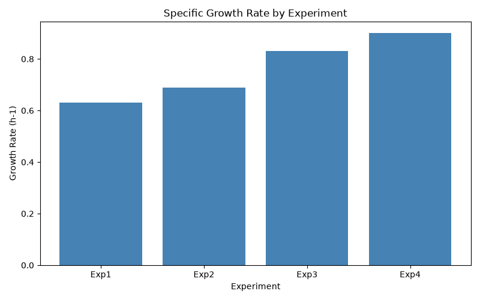
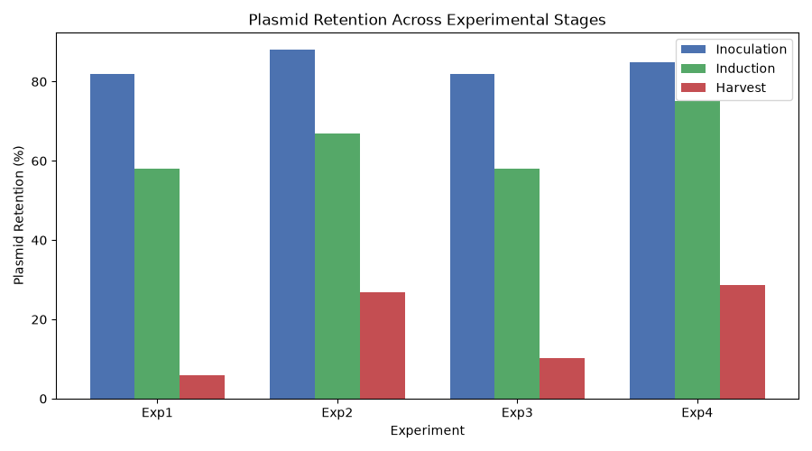
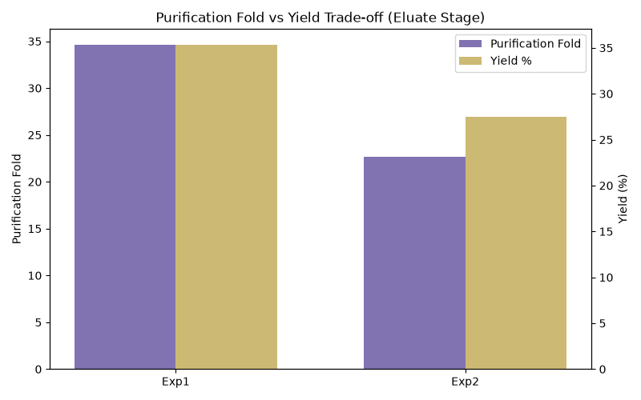

# GFP Expression Optimisation - Data Analysis Pipeline

This project reanalyses data from a recombinant protein expression
experiment on optimising GFP expression in *E. coli* BL21(DE3), using a
Central Composite Design / Response Surface Methodology approach. The
original analysis was carried out in R; this is an independent Python
implementation of the same statistical workflow.

## What it does

- Bradford assay calibration - fits a linear standard curve and
  converts absorbance readings into protein concentration
- Growth and plasmid retention analysis - compares growth rate and
  plasmid stability across experimental conditions
- Protein purification summary - tracks purity and yield through
  Crude Extract, Supernatant, and Eluate stages
- RSM regression modelling - fits First Order and Two-Way Interaction
  models using statsmodels to identify which factors most influenced
  growth rate
- Visualisations - generates bar charts comparing growth rate,
  plasmid retention, and purification trade-offs across experiments

## Results

### Growth rate by experiment

### Plasmid retention across experimental stages

### Purification fold vs yield trade-off

## Data note

The original study used a 5-factor, 44-run Central Composite Design
across 11 teams, providing sufficient data to fit complex models
reliably. This project works from the 4 summary experiments reported in
the original write-up, so the modelling has been scaled accordingly:
models shown here that exceed what 4 data points can reliably support
are flagged directly in the code as demonstrations of method rather than
statistically robust results. A small number of data points (the
Bradford standard absorbances) were back-calculated from a reported
regression equation rather than sourced from raw readings, which were
not available; this is also noted in the code.

## Running it

pip3 install -r requirements.txt
python3 main.py

This runs the full pipeline and generates three plots in the project
directory: `growth_rate_plot.png`, `plasmid_retention_plot.png`, and
`purification_plot.png`.
